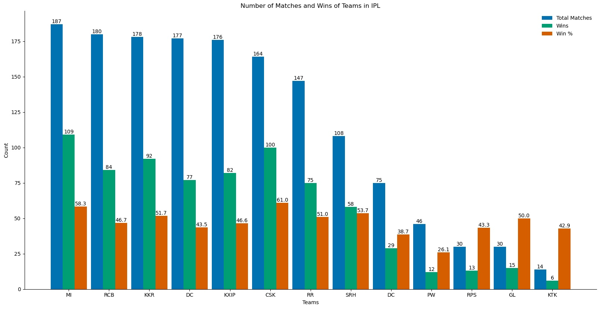
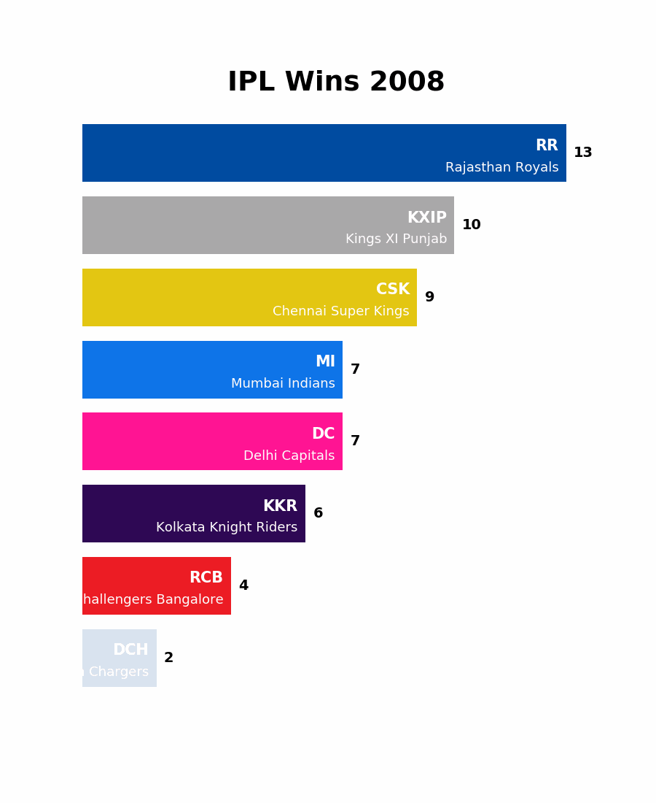

<h1 align="center">IPL Wins Bar Race</h1>

   
  <b><i>The Number of Wins in the Indian Premier League, plotted as bar chart races and a normal bar chart.</b></i>  
  <b><i>Plotted purely with Matplotlib. Assisted by Pandas.</b></i>
    

<h1 align="center">:scroll: Details </h1>

   
  <b><i>There are :three: different plots - </b></i>  
  :anchor: <b>IPL_Total_Wins</b> - <i>A grouped bar chart showing the total matches played, the number of wins and the win % of each team.</i>  
  :anchor: <b>IPL_Wins_Seasons_Race</b> - <i>A bar chart race showing the number of victories for each season.</i>  
  :anchor: <b>IPL_Wins_Top_5_Race</b> - <i>The main :star: bar chart race of 5 teams with the most victories.</i>  
   
  <a href="https://github.com/rg089/ipl_wins_bar_race#bar_chart-total-wins"> Total Wins</a> / <a href="https://github.com/rg089/ipl_wins_bar_race#bar_chart-season-wins-race">Seasons Race / </a><a href="https://github.com/rg089/ipl_wins_bar_race#bar_chartmost-overall-wins-race">Top 5 Race</a>
    

<h1 align="center">:bar_chart: Total Wins</h1>

    
  
    

<h1 align="center">:bar_chart: Season Wins Race</h1>

   
  

<h1 align="center">:bar_chart:Most Overall Wins Race</h1>

     
   
  <i>*May take some time to load.*</i>
      

<h1 align="center">:clap: Credits and Inspiration</h1>

   
  <i>
  :sparkles: Dataset taken from <a href="https://www.kaggle.com/nowke9/ipldata?select=deliveries.csv" target="_blank">here</a> and <a href="https://cricsheet.org/" target="_blank">here</a>.  
  :sparkles: Inspiration for the bar chart :bar_chart: race - <a href="https://pratapvardhan.com/blog/bar-chart-race-python-matplotlib/" target="_blank">Pratap Vardhan's Article.</a> 
  </i>
    

<h1 align="center">:pray: Thanks!</h1>

  <b>All contributions are welcome and appreciated. :+1: </b>
    
   
  <b> BYE! </b>  
  
   
  <b><i>Rishabh Gupta :copyright:</b></i>

